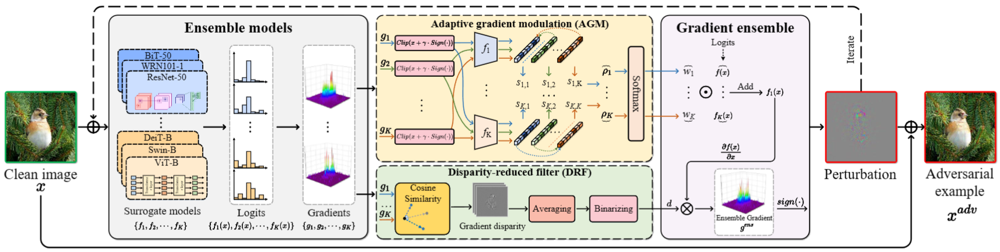

# An Adaptive Model Ensemble Adversarial Attack for Boosting Adversarial Transferability

Pytorch implement of our paper [An Adaptive Model Ensemble Adversarial Attack for Boosting Adversarial Transferability](https://arxiv.org/abs/2308.02897) accepted by ICCV2023. We proposed an adaptive ensemble attack, dubbed AdaEA, to adaptively control the fusion of the outputs from each model, via monitoring the discrepancy ratio of their contributions towards the adversarial objective. The framework of our proposed AdaEA are shown below:




## Requirements

```
numpy==1.22.3
PyYAML==6.0.1
scipy==1.11.1
timm==0.6.12
torch==2.0.1
torchvision==0.15.2
tqdm==4.65.0
```


## Usage

We use python=3.10, pytorch=2.0 and torchvision=0.15 in our code. First, clone the repository:

`git clone https://github.com/CHENBIN99/AdaEA.git`

Put the pre-trained weights of each model into the following directory:

`./checkpoint_file/cifar10/` and `./checkpoint_file/cifar100`

As for the pre-trained model of CIFAR-10/100, it can be downloaded from [Google Drive](https://drive.google.com/drive/folders/19z1Sd-FFC2rGFkc93lqVDbmHcxBxZlNt?usp=sharing)

As for the pre-trained model of ImageNet, it will be automatically downloaded from the [TIMM](https://github.com/huggingface/pytorch-image-models).


## Dataset

We use the dataset including CIFAR-10, CIFAR-100 and ImageNet. If the CIFAR-10/100 is missing, it will be automatically downloaded by Pytorch. For the ImageNet, it can be downloaded from the [official website](https://www.image-net.org/) and placed in the following way:

```
| -- data
     | -- ImageNet
          | -- val
               | -- n15075141
               | -- n13133613
               | -- ......
```

For the attack method, only the validation set is needed, not the training set.


## Run

You can run the **AdaEA** with `attack.py`. We run the script with RTX A6000:

* For AdaEA based on I-FGSM

  `python attack.py --attack_method AdaEA_IFGSM `

* For AdaEA based on DI-FGSM

  `python attack.py --attack_method AdaEA_DIFGSM `

* For AdaEA based on MI-FGSM

  `python attack.py --attack_method AdaEA_MIFGSM `

* For AdaEA based on TI-FGSM

  `python attack.py --attack_method AdaEA_TIFGSM `


## Citation

If our work is helpful for your research, please cite our publication:
```
@misc{chen2023adaptive,
      title={An Adaptive Model Ensemble Adversarial Attack for Boosting Adversarial Transferability}, 
      author={Bin Chen and Jia-Li Yin and Shukai Chen and Bo-Hao Chen and Ximeng Liu},
      year={2023},
      eprint={2308.02897},
      archivePrefix={arXiv},
      primaryClass={cs.CV}
}
```


## Help

When you have any question/idea about the code/paper. Please comment in Github or send us Email. We will reply as soon as possible.
